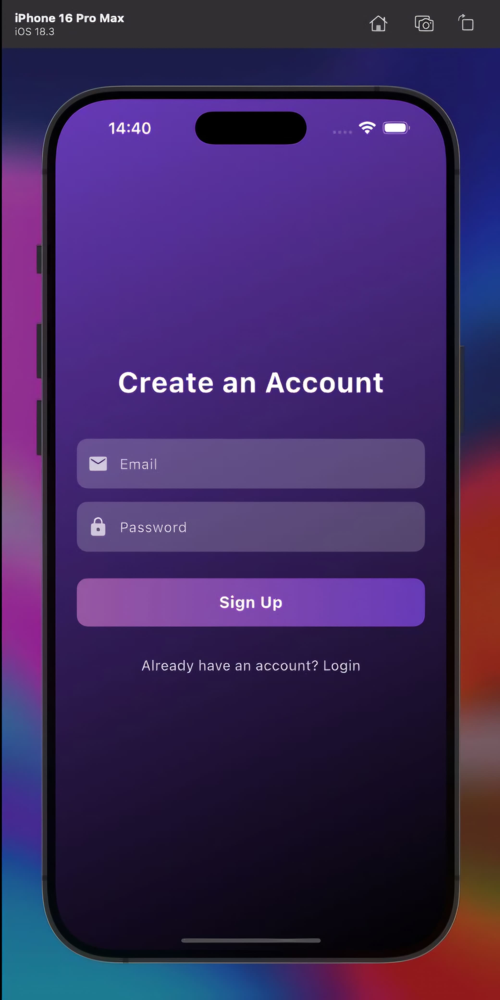

# 🐵 ApeAware – Monkey Intrusion Alert System

**ApeAware** is a Flutter-based mobile application that detects monkey intrusions using a YOLOv8 object detection model. Designed for residential and institutional security, the app provides real-time alerts and a log of all detections using Firebase Cloud Messaging (FCM) and Firestore.

###  Features

- Smart monkey detection via YOLOv8 (Python & OpenCV)
- Real-time push notifications using Firebase Cloud Messaging
- Detection logs stored in Firestore for review
- Quick-call feature for immediate action

---

###  Screenshots

<table>
  <tr>
    <td></td>
    <td></td>
    <td></td>
    <td></td>
    <td></td>
  </tr>
</table>

---

### 🛠️ Tech Stack

- **Flutter** – Mobile application frontend  
- **Firebase** – Firestore (storage) and Cloud Messaging (notifications)  
- **YOLOv8** – Real-time monkey detection (Python, Colab)  
- **OpenCV** – Video processing pipeline  

---

### ⚙️ Setup Instructions

1. Clone the repository  
   `git clone https://github.com/your-username/apeaware.git`
2. Install dependencies  
   `flutter pub get`
3. Set up Firebase (Firestore + FCM) in your project  
4. Deploy the YOLOv8 model via Google Colab or a Python server  
5. Run the app on a connected Android/iOS device

